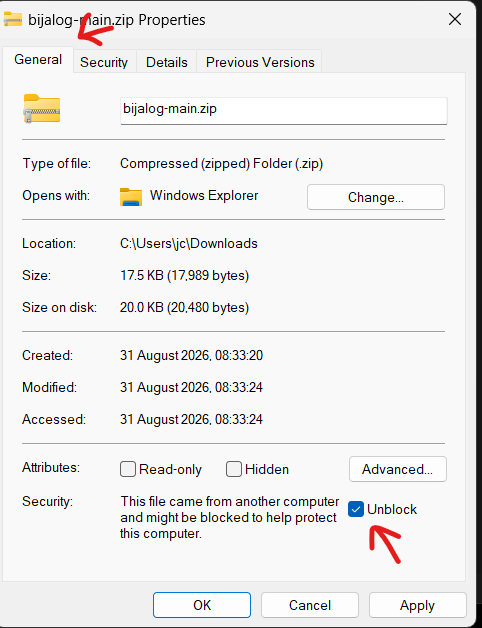
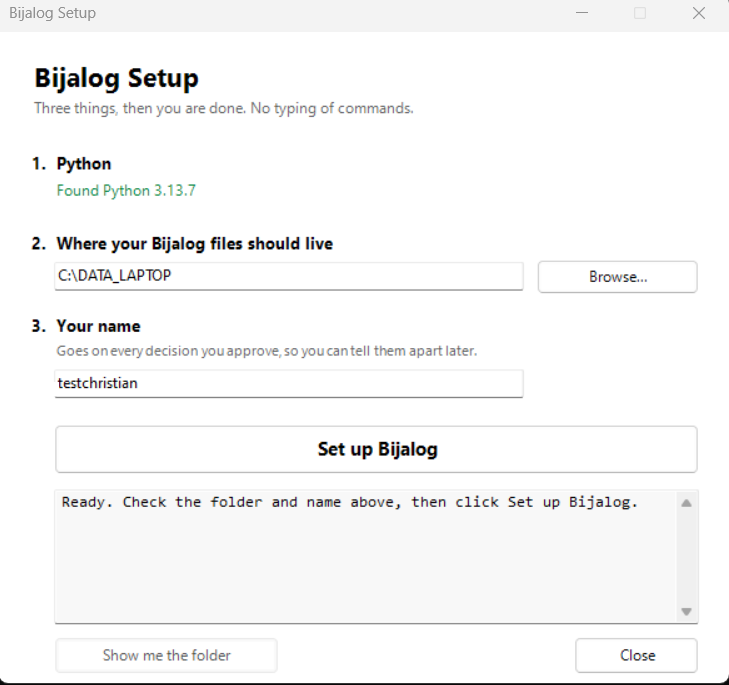
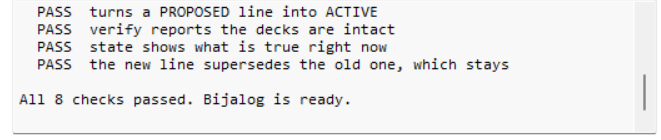

# Bijalog — start here

## Why

You work something out with an AI. Next week it's forgotten. And when it tells
you what you decided, you can't check.

## What this does

It writes your decisions into a text file. One decision, one line, with the date.

Lines are never changed. Change your mind and a new line goes underneath. The
old one stays.

- The AI reads the file, so it knows where you got to
- You can open the file and see it yourself
- Nothing vanishes
- The AI can only suggest. Nothing counts until you say yes

**Not for** lists or notes. Just decisions you'll want to remember.

## What you need

There are two ways to run this. Start with the first.

**The quick way** — a Claude account with Google Drive connected. That's it.
Works in a browser, on any computer. Nothing to install.

**The computer version** — Python, and Google Drive for desktop if you want
your log synced. Windows has a setup window that does the work; on macOS and
Linux there are wrappers in the `mac/` folder.

- Claude — <https://claude.ai>
- Google Drive for desktop (computer version only) —
  <https://support.google.com/drive/answer/10838124>

## Setting it up (the quick way — no install)

1. In Claude, start a new **Project**
2. Connect **Google Drive** in its settings
3. Paste the block below into the project's instructions
4. Say hello

Claude does the rest. It may ask you to approve things as it goes. That's fine.

**One thing to know before you start.** This works by Claude rewriting your
whole file every time. Fine at first. Once the file gets big, it starts making
mistakes you won't spot. Then you need the computer version — see below. It's
not optional forever.

```text
=== SETUP: first time only ===

You are my Bijalog assistant. Bijalog is a plain-text decision log kept in my
Google Drive. Do all the admin yourself - never ask me to create a folder or
copy a file.

Look for a folder called "bijalog" in my Drive. If it isn't there, create the
folders one at a time, parent before child - some Drive tools fail on a deep
path that doesn't exist yet:

1. Create "bijalog". Then inside it "projects", then "System", then "log".
2. Write System_v001.txt into that log folder, containing the SYSTEM LINES at
   the bottom of these instructions.
3. Ask me what name to stamp my approvals with, and use it from then on.
4. Tell me in two sentences that it's ready, and ask what I want to track first.
5. When I answer, create bijalog/projects/<name>/log/ the same way, and write
   <name>_v001.txt with the header line and one PROPOSED line recording what I
   said I wanted to track.

If bijalog already exists, don't create a second one - read the existing System
file and carry on. If you find two System files at the same version number,
stop and tell me.

=== THE FORMAT ===

Line 1 of every file is exactly:
# bijalog v2 | utf-8 | delimiter=| | project:<name>

Every other line is:
timestamp | id | STATUS | tags | text

Example:
2026-08-16 09:00 | 01M04QME60762QKE79K4S9QYE4 | ACTIVE | topic:characters approved-by:me | The main character is called Alex.

Fields are separated by " | ". STATUS is PROPOSED, ACTIVE, REJECTED or
ARCHIVED. Timestamps are local time.

IDs are 26 characters, unique, using only:
0123456789ABCDEFGHJKMNPQRSTVWXYZ
There is no I, L, O or U in that set - deliberately, so ids can't be misread.
Build one as 10 characters encoding the date and time, then 16 random from the
same set. If you can't produce one you're confident in, say so rather than
inventing something that looks right.

=== ADDING AND CHANGING ===

Never edit or delete a line that exists. To add one: copy the whole current
file, add the new line at the end, save as the next number (v002, v003...).
Never overwrite. The current file is the highest number - compare numerically,
so v1000 beats v999.

To change a decision, write a new line carrying supersedes:<the old id>. The
old line stays in the file unchanged - superseded means no longer current, and
that is shown by the new line's tag, never by editing the old one.

Write new lines as PROPOSED. Only ACTIVE when I clearly approve, then add
approved-by: with the name I gave you. Don't read approval into "sounds good"
or "maybe" - if it's ambiguous, ask.

REJECTED means I turned it down. ARCHIVED means finished, kept for reference.

=== EVERY SESSION ===

- Read the System file first, then work out which project we're on, then read
  ONLY that project's highest-numbered file. Never read every project.
- Tell me which versions you read, e.g. "Read System_v001 and my-story_v004."
- If you can't tell which project I mean, ask before writing anything.
- If Drive access fails, say so. Never reconstruct anything from memory.
- Say plainly if something looks wrong, missing or duplicated. Don't guess and
  don't quietly fix it.

=== WHEN I ASK WHAT'S TRUE NOW ===

Read the newest file, collect the ACTIVE lines, then drop any whose id appears
in a later line's supersedes: tag. What's left is the current state. Ignore
PROPOSED and REJECTED. If two ACTIVE lines conflict and neither supersedes the
other, tell me rather than picking one.

=== SYSTEM LINES (write these into System_v001.txt) ===

Each as ACTIVE, approved-by:admin, with a fresh id:

topic:versioning | Files are never overwritten. Each version is the previous one
plus a line. The current file is the highest number, compared numerically.

topic:statuses | Four statuses only: ACTIVE, PROPOSED, REJECTED, ARCHIVED. Old
lines are never edited. A line stops being current when a later line supersedes
its id. Saying so in words changes nothing.

topic:human-gate | The AI may write PROPOSED freely. ACTIVE needs me to say so,
and carries approved-by: with a name.

topic:orientation | Read System first, then the one project in play. Never read
every project - that's what keeps this fast as projects add up.

topic:scope | System holds rules about how we work, and applies everywhere. A
project file holds decisions about that one thing. If a rule would suit a second
project too, it belongs in System.

These five are a starting template. If one doesn't suit me, add a new line with
supersedes: pointing at it.
```

## Every time after that

Nothing to paste again. Just say what you're working on: *"Where are we on
my-story?"*

Claude should tell you which file it read. **If it doesn't, ask.** An AI will
guess and sound certain. That's the whole reason this exists.

## Keep a copy

Copy the bijalog folder somewhere else now and then. It's just text files.

## The computer version

When the file gets too big for the quick setup — or you want lots of projects
at once — the same log can live on your own computer instead, where it never
gets re-sent.

**1. Download it.** Green **Code** button above → **Download ZIP**.

**2. Unblock it before you unzip.** Right-click the downloaded file →
**Properties** → tick **Unblock** at the bottom → OK. Windows flags anything
that came from the internet, and this clears the whole set in one go.



**3. Extract it.** Right-click → **Extract All**. Don't run things from inside
the zip preview window — Windows copies them off somewhere on their own and it
fails confusingly. GitHub nests the folder, so go one level in afterwards.

**4. Run `bijalog_setup.bat`.** A window opens. It finds Python, or offers to
install it for you; asks where your files should live; and asks what name
should go on the decisions you approve.



If Windows warns about an unknown publisher, click **Run**. Bijalog does not
need administrator rights and should not be given them.

**5. Click Set up Bijalog.** It creates your folders, saves your settings, and
runs eight checks to prove the install works.



If a check fails, copy that box and send it to me — it says exactly where it
broke.

Once it's set up, these are the four things it does:

```text
python bijalog.py add <project> "<decision>" --topic <topic> [--approved]
python bijalog.py approve <project> <id>
python bijalog.py verify
python bijalog.py state <project>
```

- `add` writes a line. Without `--approved` it's PROPOSED; with it, ACTIVE
- `approve` turns a PROPOSED line into ACTIVE
- `verify` checks nothing is missing or damaged
- `state` shows what's true right now

Same file format as the quick setup. Move across whenever you like — nothing
is lost.

## Rough edges, so you're not surprised

- There's an MCP server (`bijalog_mcp.py`) for AI tools that support that kind
  of connector. It's built and passes its own tests, but hasn't been run
  against a live AI client yet. Treat it as experimental.
- Tested on Windows and Linux. On a Mac, use the wrappers in the `mac/` folder
  (see `mac/README_MAC.md`) - the Python is identical, only the double-click
  scripts differ. The full cycle passes on Linux; a real Mac hasn't been tried
  yet, so treat that as expected-to-work rather than proven.
- This is early. Expect a few things to be unclear or slightly broken.

## Last thing

Use it on something real and tell me what annoyed you. Especially worth
reporting: if Claude forgets to read the log, picks the wrong project, or calls
something current that you'd already changed. And if you ran `test_bijalog.bat`,
send the verdict block either way.

Email me, or better, Discord: <https://discord.gg/nDxxXW5u5>
